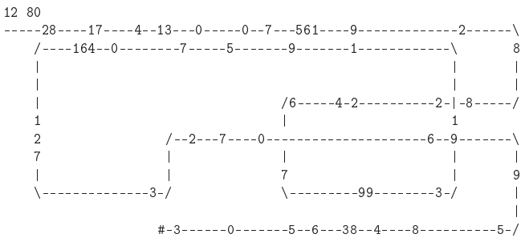

# Follow the Money

After pulling off a successful heist at a major bank, the bandits escaped from the city using a trail of notes as a decoy. The police managed to pursue the gang to try and recover the money that was being scattered. The gang presented the police with a map with the escape route, in order to challenge them to find the money. Below are the rules for the challenge and an example map provided by the bandits.

## Rules

1. The map presented by the bandits shows the trail left by them;
2. The first information on the map is its size, in rows and columns;
3. The trail starts at some point on the left side, with the car of the bandits heading to the right;
4. The car always follows a straight line unless it encounters the symbols '/' or '\\', which are signals to make a turn;
5. The bandits finally mark the spot where they were captured with an '#';
6. Upon finding money along the way, the amount collected must be kept for later return. But be careful, the money should be collected in the order in which it is found!

In the example below the bandits indicate the direction to the right for the first '/' and to the left for the first '\\'. Thus, on the path of '8 28 reais'. If these symbols are encountered again, they would indicate a change of direction and the values found at these intersections would be '82 reais'. How many times these symbols can be found at intersections and fall into a crossing.

With all the information on the map, it's simple: you need to analyze the maps that are in possession, discovering how much was recovered by the police and in the end present a report with the findings.

## Problem Solved:

- How was the problem solved;
- How the problem was modeled;
- Comment on the process of the solution, presenting examples of algorithms;
- Results of test cases;
